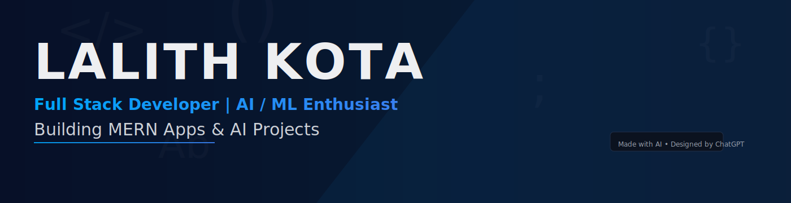

  <!-- Replace with the raw URL of the banner you upload to your repo -->
  

<h1 align="center">👋 Hi, I'm <b>LALITH KOTA</b></h1>

  

---

## 🚀 About Me  
- 🎓 B.Tech in Information Technology (2023–2027)  
- 💡 Passionate about **MERN Development**, **ML Projects**, and **AI Tools**  
- 🤖 Built **FinTrack**, **Spam Classifier**, **Offline Chatbot**, **E-Commerce App**  
- 🔥 Exploring **AI Agents, LLMs, and Full-Stack Development**  
- 🚀 Always learning and building something new

---

# 🛠️ Tech Stack (With Icons)

### 🧑‍💻 **Programming Languages**

  

### 🎨 **Frontend**

  

### ⚙️ **Backend & Databases**

  

### 🧰 **Tools & Platforms**

  

---

## 📌 Software & AI Projects

---

###  **FinTrack – Smart Expense Tracker (MERN + AI)**  

🚀 **FinTrack** is an AI-powered expense tracker built to simplify money management with smart automation and analytics.

**🔹 Key Features**
- GPT-based Smart Saving Suggestions  
- Voice assistant for hands-free expense entry  
- Real-time analytics & charts  
- Secure backend & responsive UI  

**🛠 Tech Stack:** React, Node.js, Express, MongoDB, Chart.js, GPT  
**📌 Status:** Near complete  

---

###  **AI-Based Spam Classifier**  

ML pipeline that accurately detects SMS spam using classical machine learning models.

**🔹 Key Features**
- TF-IDF vectorization  
- Naive Bayes & SVM classification  
- Flask UI for real-time predictions  

**🛠 Tech Stack:** Python, Scikit-learn, Pandas, Flask  
**📌 Status:** Completed  

---

###  **Offline Chatbot (React + Ollama)**  

A privacy-first AI chatbot that runs fully **offline** using local LLMs powered by Ollama.

**🔹 Key Features**
- 100% offline LLM inference  
- Modern React chat interface  
- Smooth real-time message flow  

**🛠 Tech Stack:** React, JavaScript, Ollama  
**📌 Status:** Completed  

---

###  **E-Commerce Shopping Cart System (MERN)**  

A functional e-commerce prototype covering essential shopping cart features.

**🔹 Key Features**
- Product listing & add-to-cart  
- JWT authentication  
- Test payments (Stripe test mode)  
- Admin product management  

**🛠 Tech Stack:** MERN, JWT, Stripe (Test Mode)  
**📌 Status:** Near complete  

---

## 📌 Featured Projects

  
<b>🌾 Crop-Connect – Smart Agriculture Platform</b>

   
  Crop-Connect is an intelligent agriculture support system that connects farmers, buyers, and resources.  
  It helps track crop health, market prices, and provides AI-powered recommendations for better yield.
    

  **🚀 Features**
  - Real-time crop data tracking  
  - AI insights for better crop decisions  
  - Buyer–farmer digital marketplace  
  - Secure user login and dashboards  
  - Mobile-responsive UI  

  **🛠️ Tech Stack:** MERN Stack, React, Node.js, MongoDB, Express, Chart.js  

  
<b>🎁 Surprise Project – Coming Soon </b>

   
  A new intelligent system currently under development.  
  More details will be added after release! 🚀✨

  **Status:** Under Development  

---
## 🏆 Achievements
- Selected for **Smart India Hackathon (SIH)** — Phase-2 selected team  
- **Top-5** in college hackathon (consolation award)  
- **Patent Application:** *Integrated Crop Monitoring & Farmer-Market Connectivity Platform* (App ID: **202541043259**) — Under Review

---

## 📊 GitHub Stats

---

## 🌐 Connect With Me

  
  
  

<b>🔥 Consistency + Curiosity = Growth</b>

